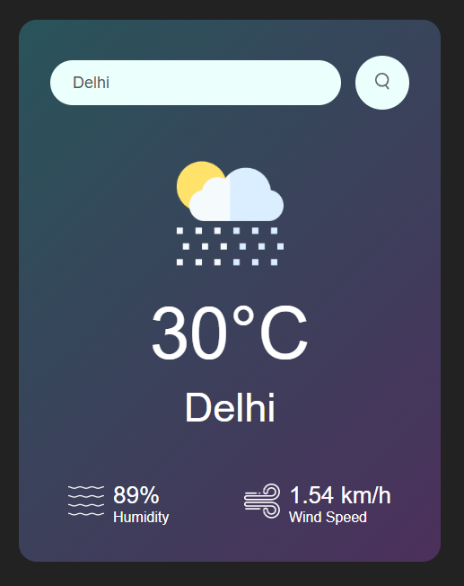

# Weather App

A simple and elegant weather application that provides current weather conditions for any city using the OpenWeatherMap API.

## Features

- **Search Functionality**: Users can search for the current weather in any city by entering the city name.
- **Weather Details**: Displays temperature, humidity, wind speed, and weather conditions.
- **Error Handling**: Shows an error message if an invalid city name is entered.

## Demo




## Getting Started

Follow these instructions to set up and run the project on your local machine.

### Prerequisites

- A modern web browser
- Node.js (optional, if you want to run a local server)

### Installation

1. **Clone the repository**:
    ```bash
    git clone https://github.com/yourusername/weather-app.git
    ```
2. **Navigate to the project directory**:
    ```bash
    cd weather-app
    ```

3. **Open `index.html` in your browser**:
    ```bash
    open index.html
    ```
   Alternatively, you can serve the files using a local server:
   ```bash
   npx http-server
   
# Usage
Enter the name of a city in the search box.
Click the search button.
The current weather conditions for the city will be displayed.

#Code Overview
**index.html
This file contains the structure of the application, including the input field for the city name, the weather display, and error handling elements.

**style.css
This file provides the styling for the application, ensuring a modern and responsive design with a gradient background, centered card, and weather icons.

**script.js
This file handles the API requests to OpenWeatherMap and updates the DOM based on the weather data received or if an error occurs.

# API
This app uses the OpenWeatherMap API to fetch real-time weather data.
**Base URL: https://api.openweathermap.org/data/2.5/weather
**Parameters:
q: City name
units: Metric (for temperature in Celsius)
appid: Your unique API key

# Contributing
Contributions are welcome! Please fork the repository and submit a pull request with your changes.

# Acknowledgments
OpenWeatherMap for providing the weather data.
Unsplash for the icons used in the application.


   
